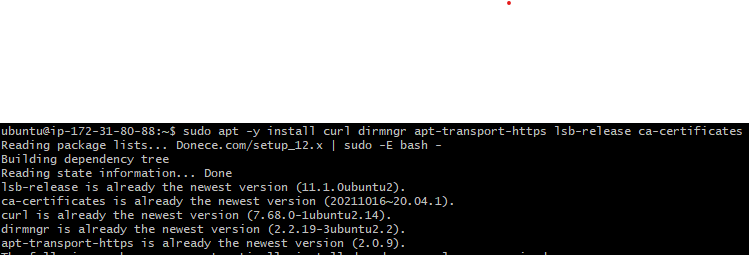
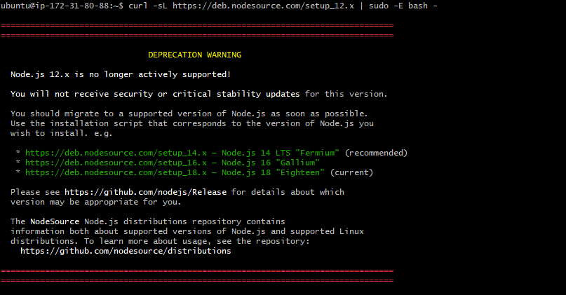
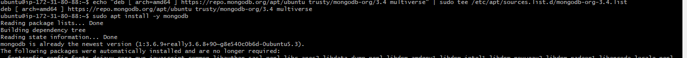
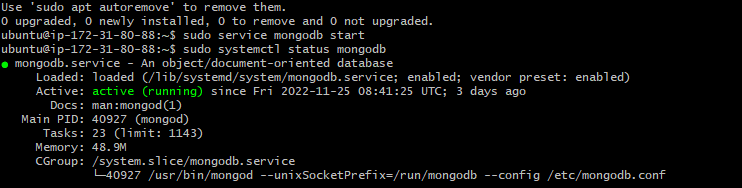
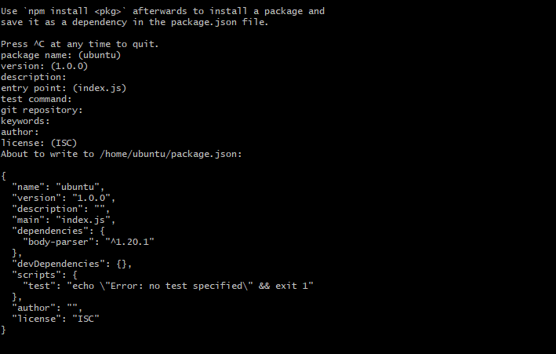
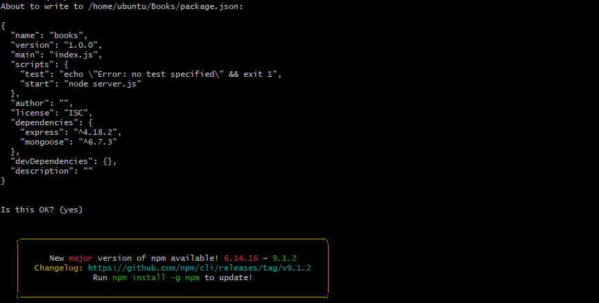
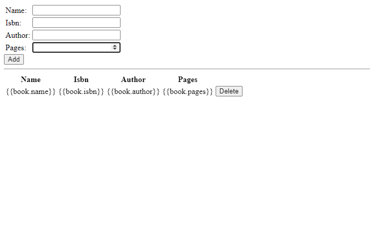

# MEAN STACK DEPLOYMENT TO UBUNTU IN AWS

Now, when you have already learned how to deploy LAMP, LEMP and MERN Web stacks – it is time to get yourself familiar with MEAN stack and deploy it to Ubuntu server.

## result i got while doing proect 4

1

 

